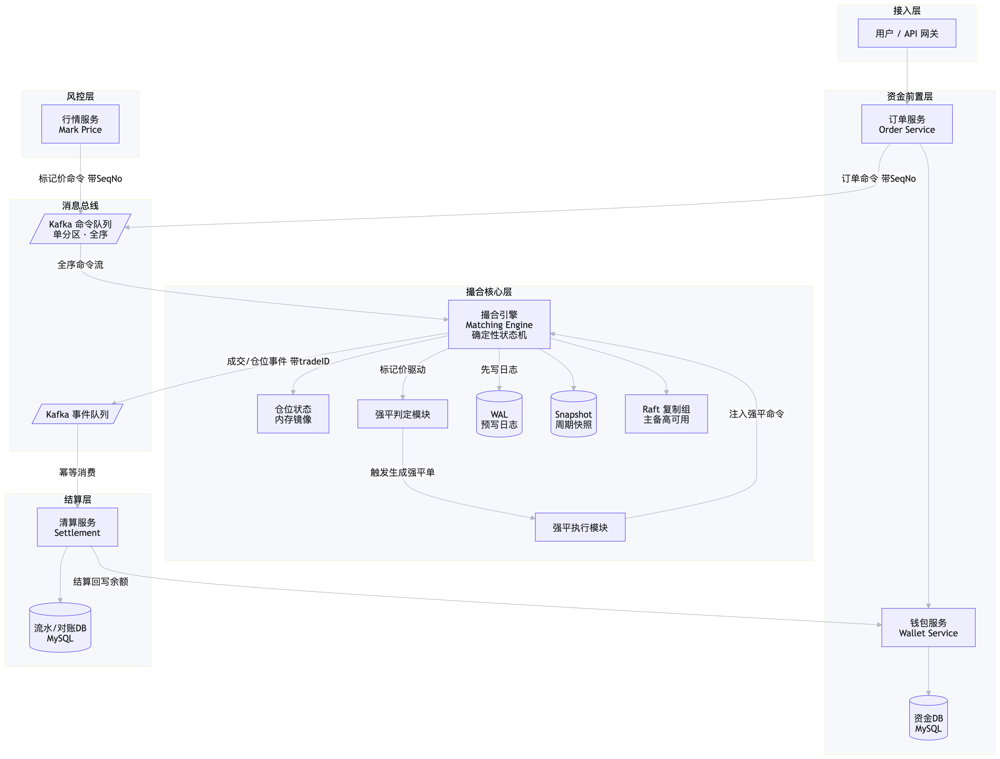
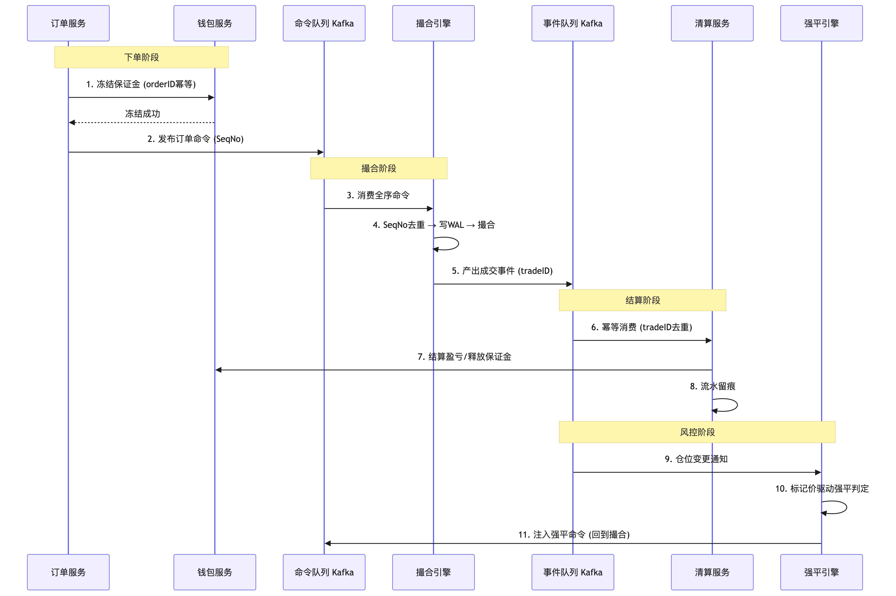
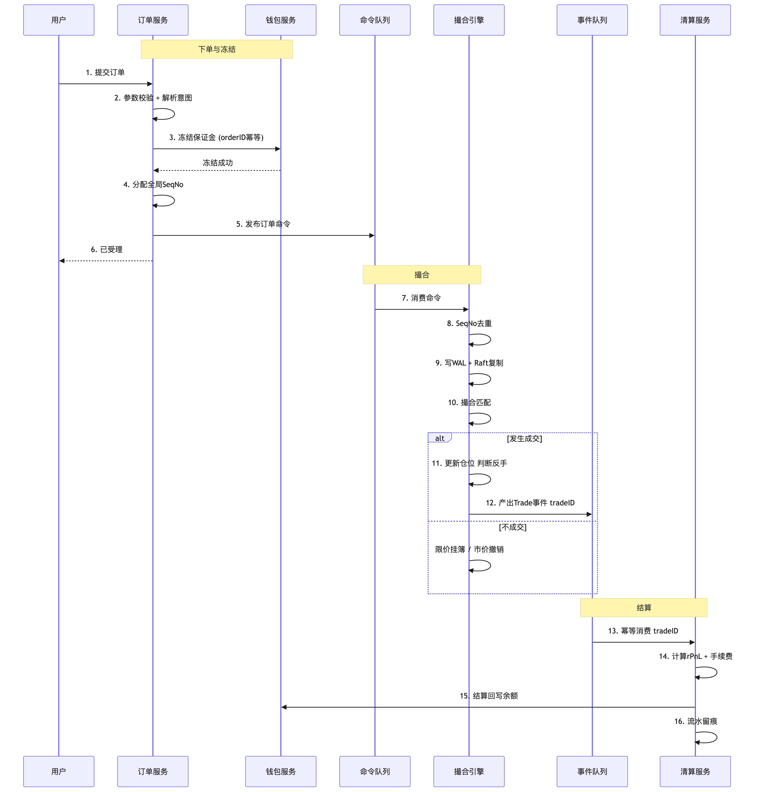
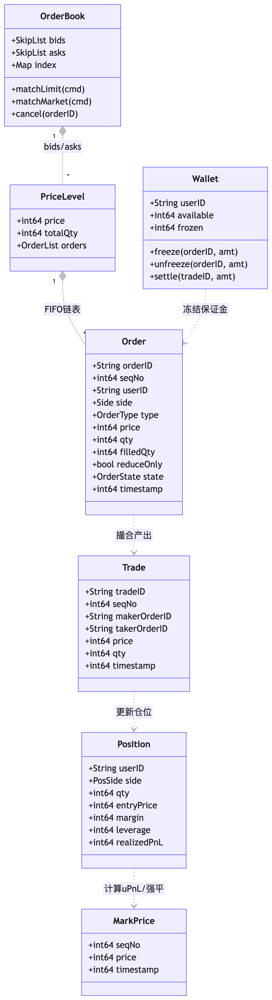
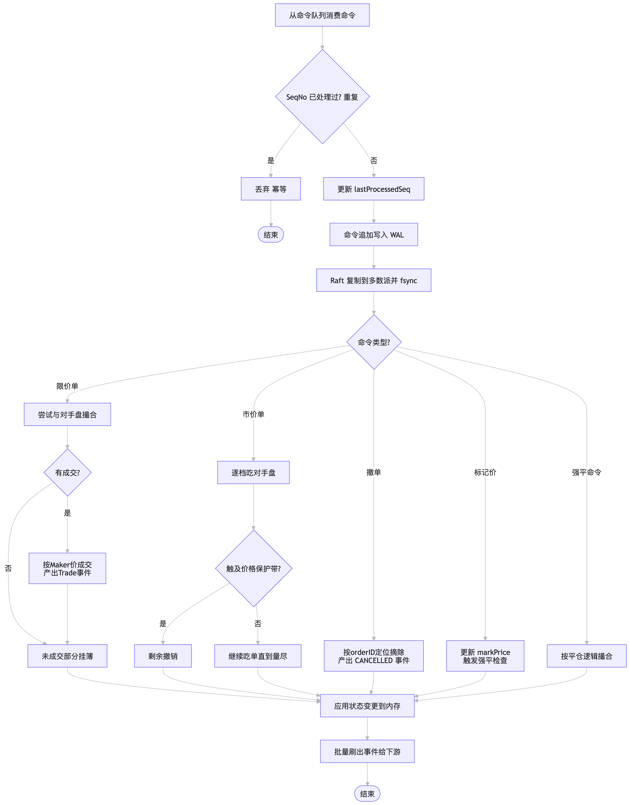
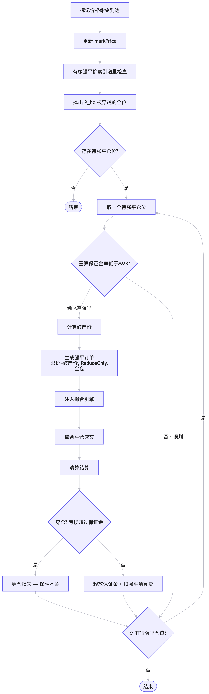
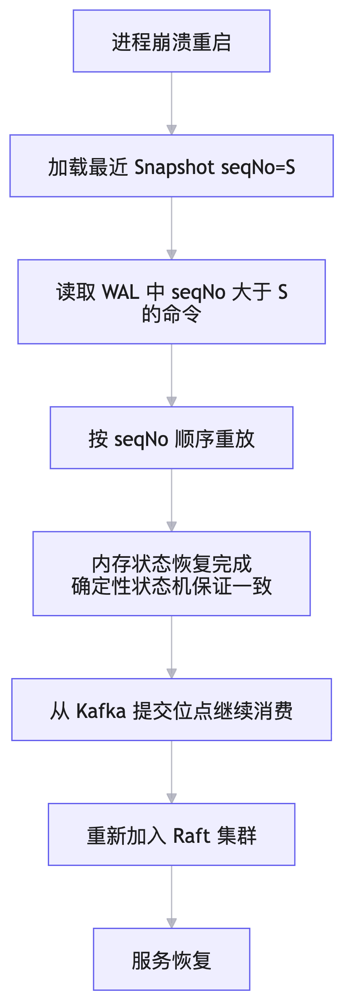

# 合约撮合

## 一、系统整体定义设计

| 角色        | 类型         | 职责                           | 关键权限                                 |
| ----------- | ------------ | ------------------------------ | ---------------------------------------- |
| 交易用户    | 外部         | 提交订单、查询仓位             | 仅操作自己的订单/仓位                    |
| 订单服务    | 系统         | 接收订单、校验、冻结保证金     | 调用钱包冻结；写入命令队列               |
| 撮合引擎    | 系统（核心） | 维护订单簿、执行撮合、产出成交 | 只读命令流、写 WAL 与事件流；不做资金 IO |
| 清算服务    | 系统         | 结算盈亏、更新仓位、回写余额   | 读成交事件；写钱包与仓位账本             |
| 强平引擎    | 系统（风控） | 监控保证金率、触发强平         | 读仓位\+标记价；注入强平命令             |
| 行情服务    | 外部         | 提供标记价格                   | 推送标记价命令                           |
| 钱包服务    | 系统         | 持有真实余额、冻结/解冻        | 资金域唯一写入口                         |
| 运维/管理员 | 人员         | 监控、对账、应急               | 只读\+ 对账冲正（需审批）                |

## 二、架构分层

系统分为五层：接入层 → 资金前置层 → 撮合核心层 → 结算层 → 风控层，通过单向事件流串联。

\-1786001823434\.png" />

撮合引擎状态机保存：

仓位（方向、数量、开仓均价）

保证金占用额（镜像，用于判定）

ReduceOnly / 单向持仓判定

平仓量是否超持仓

### 核心设计原则

1. 单交易对单命令流
   同一交易对的所有命令进入同一个 Kafka 分区，保证全序。
2. 撮合引擎是确定性状态机
   所有状态变更只来自已提交命令，相同命令序列必须产生相同结果。
3. 撮合不做资金 IO
   撮合引擎只维护订单簿、仓位、保证金镜像，不调用钱包服务。
4. 资金变动由清算服务完成
   清算服务消费成交事件，更新钱包余额、冻结、解冻、资金流水。
5. 仓位在撮合引擎内存中维护
   用于平仓校验、单向持仓、反手拆分、强平判定。
6. 清算仓位账本只是投影
   清算服务可以维护仓位账本用于查询和对账，但不能反向修改撮合引擎内存状态。
7. 所有关键命令都进入日志
   包括订单、撤单、标记价、强平命令。
8. 只有 Raft Leader 执行撮合
   Follower 只复制日志，避免双主撮合。

## 三、模块交互时序图

\-1786001961934\.png" />

下单到结算的完整时序图：

\-1786005876960\.png" />

## 四、数据结构设计

### UML图

\-1786002070084\.png" />

### 伪代码定义

```Go
type OrderBook struct {
//SkipList 的每个节点是一个价格档位，档位内是 FIFO 队列。
    bids   *SkipList          // 买单，价格降序，头节点=最高买价
    asks   *SkipList          // 卖单，价格升序，头节点=最低卖价
    index  map[string]*Order  // orderID -> Order（撤单用）
}
// 选择 SkipList 是因为价格档位需要有序访问，同时需要高效插入、删除和范围扫描。
// 相比红黑树，SkipList 实现更简单，且同价位可以挂载 FIFO 队列；
//相比固定价格桶，SkipList 对价格范围变化更灵活。index map 用于 O(1) 撤单。

type Order struct {
    OrderID    string
    SeqNo      int64     // 上游全局序号（幂等键）
    UserID     string
    Side       Side      // Buy / Sell
    Type       OrderType // Limit / Market
    Price      int64     // 限价价格；市价单为 0
    Qty        int64     // 委托量
    FilledQty  int64     // 已成交量
    ReduceOnly bool      // 平仓单标记
    State      OrderState
}

type Position struct {
    UserID       string
    Symbol       string     *// BTC-USDT*
    Side         PosSide    *// EMPTY / LONG / SHORT*
    Qty          int64      *// 持仓数量 (绝对值, >0)*
    EntryPrice   int64      *// 开仓均价 (加权平均)*
    Margin       int64      *// 已分配保证金 (逐仓)*
    Leverage     int64      *// 杠杆倍数*
    RealizedPnL  int64      *// 累计已实现盈亏*
  
     *// 强平索引字段*
    Key         PositionKey
    LiqPrice    int64  *// 当前已写入索引的强平价*
    PosVersion  uint64 *// 仓位版本号，每次仓位风险状态变化时递增*
    Indexed     bool   *// 是否已经在 active 强平索引中*
}

```

## 五、撮合流程

### 订单撮合原则

1. 价格优先：买单价高者优先，卖单价低者优先。
2. 时间优先：同价位按 SeqNo 先后。
3. 成交价 = Maker 价。
4. 部分成交：允许。
5. 单向持仓约束：平仓单只减仓不开仓。

### 三类订单处理

#### 限价单（Limit）：

1. 先尝试与对手盘撮合（买单价 ≥ 卖一价即成交）。
2. 成交价 = 挂单方（Maker）价格。
3. 未成交部分按价格插入对应档位，同价位按 SeqNo 追加（时间优先）。
4. 支持部分成交，剩余继续挂订单簿。

#### 市价单（Market）：

1. 不挂簿，立即吃对手盘。
2. 逐档\(价格最大\)成交直至量耗尽。
3. 价格保护带：成交价不得超出标记价 ±N%（如 ±5%），超出撤销。

#### 撤单（Cancel）：

1. 按 orderID 定位。
2. 校验状态（全部成交不可撤单）。
3. O\(1\) 取消，产出 `OrderCancelled` 事件。

### 伪代码

```Go
func (e *Engine) handle(cmd Command) {
    // 幂等去重
    if cmd.SeqNo <= e.lastSeq { return }
    e.lastSeq = cmd.SeqNo

    e.wal.Append(cmd)            // 先写 WAL 日志(可用于故障恢复)

    switch cmd.Type {
    case CMD_LIMIT:      e.matchLimit(cmd)
    case CMD_MARKET:     e.matchMarket(cmd)
    case CMD_CANCEL:     e.cancel(cmd)
    case CMD_MARK_PRICE: e.applyMarkPrice(cmd)   // 价格标记也是命令
    case CMD_LIQUIDATE:  e.matchLiquidation(cmd) // 强平命令
    }
}


func (e *Engine) matchLimit(cmd Command) {
    order := toOrder(cmd)
    for order.Remaining() > 0 {
        level := e.book.BestOppositeLevel(order.Side)
        if level == nil {
            break
        }
        if order.Side == BUY && order.Price < level.Price {
            break
        }
        if order.Side == SELL && order.Price > level.Price {
            break
        }
        for order.Remaining() > 0 && level.TotalQty > 0 {
            maker := level.FrontOrder()
            fillQty := min(order.Remaining(), maker.Remaining())

            if fillQty <= 0 {
                break
            }
            e.executeTrade(order, maker, level.Price, fillQty)
            if maker.IsDone() {
                level.PopFront()
                e.book.RemoveOrderFromIndex(maker.OrderID)
            }
        }
        if level.IsEmpty() {
            e.book.RemoveLevel(level)
        }
    }
    if order.Remaining() > 0 {
        e.book.Insert(order)
        e.emitOrderAccepted(order)
    }
}

func (e *Engine) matchMarket(cmd Command) {
    order := toOrder(cmd)
    for order.Remaining() > 0 {
        level := e.book.BestOppositeLevel(order.Side)
        if level == nil {
            e.emitOrderCancelled(order, "no_liquidity")
            return
        }
        if !e.withinPriceBand(order.Side, level.Price) {
            e.emitOrderCancelled(order, "price_band")
            return
        }
        for order.Remaining() > 0 && level.TotalQty > 0 {
            maker := level.FrontOrder()
            fillQty := min(order.Remaining(), maker.Remaining())

            if fillQty <= 0 {
                break
            }
            e.executeTrade(order, maker, level.Price, fillQty)
            if maker.IsDone() {
                level.PopFront()
                e.book.RemoveOrderFromIndex(maker.OrderID)
            }
        }
        if level.IsEmpty() {
            e.book.RemoveLevel(level)
        }
    }
    if order.Remaining() > 0 {
        e.emitOrderCancelled(order, "market_remaining_cancelled")
    }
}

func (e *Engine) cancel(cmd Command) {
    order := e.book.GetOrderByID(cmd.OrderID)

    if order == nil {
        e.emitCancelAck(cmd, "already_removed_or_unknown")
        return
    }

    if order.State == FILLED {
        e.emitCancelRejected(cmd, "already_filled")
        return
    }

    if order.State == CANCELLED {
        e.emitCancelAck(cmd, "already_cancelled")
        return
    }

    e.book.Remove(order)
    order.State = CANCELLED

    e.emitOrderCancelled(order, "user_cancel")
}

func (e *Engine) executeTrade(taker *Order, maker *Order, price int64, qty int64) {
    tradeID := e.nextTradeID()
    taker.FilledQty += qty
    maker.FilledQty += qty
    e.applyPositionChange(taker.UserID, taker.Side, qty, price, taker.ReduceOnly)
    e.applyPositionChange(maker.UserID, maker.Side, qty, price, maker.ReduceOnly)
    e.emitTradeEvent(tradeID, taker, maker, price, qty)
}
```

### 处理流程

\-1786003424903\.png" />

## 六、保证金与仓位

### 仓位管理

仓位状态在撮合引擎内存中维护；仓位的资金结算在清算服务。订单服务不碰仓位。

为什么在撮合引擎中：

撮合引擎在撮合时必须实时知道仓位，用于：

- 平仓校验（平仓单只减仓不开仓）
- 平仓量截断（不能超过持仓量）
- 单向持仓约束（判断是否反手）
- 反手拆分（平仓\+开仓）

如果仓位放在外部服务，撮合每次成交都要跨服务调用，引入延迟和一致性风险。

### 保证金计算与冻结

```Go
func calcFreezeMargin(orderType, price, bestOppPrice, qty, leverage int64) int64 {
    IMR := 10000 / leverage  // 万分比
    var priceBase int64
    if orderType == LIMIT {
        priceBase = price
    } else {
        priceBase = bestOppPrice * (10000 + SLIPPAGE_BPS) / 10000  // 市价单 增加一定的冻结buffer
    }
    return priceBase * qty * IMR / 10000 / PRECISION
}

func calcUPnL(pos *Position, markPrice int64) int64 {
    dir := int64(1); if pos.Side == SHORT { dir = -1 }
    return (markPrice - pos.EntryPrice) * pos.Qty * dir / PRECISION
}

func shouldLiquidate(pos *Position, markPrice int64) bool {
    uPnL := calcUPnL(pos, markPrice)
    marginBalance := pos.Margin + uPnL
    maintMargin := markPrice * pos.Qty * MMR / 10000 / PRECISION
    return marginBalance < maintMargin
}

func calcBankruptcyPrice(pos *Position) int64 {
    if pos.Side == LONG {
        return pos.EntryPrice - pos.Margin*PRECISION/pos.Qty
    }
    return pos.EntryPrice + pos.Margin*PRECISION/pos.Qty
}
```

## 七、平仓\&强平\&反向开仓\&结算

平仓本质上是开一个反向单来结算

下单应该有意图判断的逻辑：

| 当前仓位 | 下单         | 实际意图        |
| -------- | ------------ | --------------- |
| 空仓     | Buy          | 开多            |
| 空仓     | Sell         | 开空            |
| 多头     | Sell ≤ 持仓 | 平多            |
| 多头     | Sell\> 持仓  | 平多\+ 反手开空 |
| 空头     | Buy ≤ 持仓  | 平空            |
| 空头     | Buy\> 持仓   | 平空\+ 反手开多 |

强平触发条件：保证金余额 \< 维持保证金。由价格标记来驱动

```Go
强平条件:  保证金余额 < 维持保证金
即:        Margin + uPnL < P_mark × Q × MMR

推导强平价 P_liq:
  LONG:  P_liq = P_entry × (1 - IMR + MMR)  
  SHORT: P_liq = P_entry × (1 + IMR - MMR)  

精确求解 (LONG):
  Margin + (P_liq - P_entry) × Q = P_liq × Q × MMR
  → P_liq = (Margin - P_entry×Q) / (Q×(MMR - 1)) × (-1)
  → P_liq = (P_entry×Q - Margin) / (Q×(1 - MMR))
  
// 破产价:破产价是保证金刚好亏完的价格。（极端情况使用，比如：对手盘不足等）
func calcBankruptcyPrice(pos *Position) int64 {
    if pos.Side == LONG {
        return pos.EntryPrice - pos.Margin*PRECISION/pos.Qty
    }

    return pos.EntryPrice + pos.Margin*PRECISION/pos.Qty
}
```

强平流程：

1. 标记价命令触发，有序索引找出 P\_liq 被穿越的仓位
2. 二次确认：重算保证金率 \< MMR
3. 生成强平订单（限价=破产价, ReduceOnly, 全仓, 高优先级）
4. 注入撮合引擎，走正常撮合流程
5. 成交 → 清算结算 → 释放保证金 \+ 扣强平清算费
6. 穿仓 → 交保险基金机制

\-1786005683646\.png" />

平仓：

```Go
func settleClose(pos *Position, Pc, Qc int64) SettlementResult {
    dir := int64(1); if pos.Side == SHORT { dir = -1 }

    rPnL := (Pc - pos.EntryPrice) * Qc * dir / PRECISION
    fee := Pc * Qc * FEE_RATE / 10000 / PRECISION
    releasedMargin := pos.Margin * Qc / pos.Qty        // 逐仓按比例释放
    settleAmount := releasedMargin + rPnL - fee

    pos.Qty -= Qc
    pos.Margin -= releasedMargin
    pos.RealizedPnL += rPnL
    if pos.Qty == 0 { pos.Side = EMPTY }

    return SettlementResult{
        RPnL: rPnL, Fee: fee,
        ReleasedMargin: releasedMargin,
        SettleToWallet: settleAmount,
    }
}
```

反手：

```Go
// 持 LONG 10, 下 Sell 15 → 平10 + 开空5
func settleReverse(pos *Position, totalQty, Pc int64) {
    closeQty := pos.Qty
    openQty := totalQty - pos.Qty

    // Step 1: 先平仓
    closeResult := settleClose(pos, Pc, closeQty)
    // → pos.Side == EMPTY, rPnL 结算落钱包

    // Step 2: 再开仓
    newPos := &Position{
        Side: SHORT, Qty: openQty,
        EntryPrice: Pc, Leverage: pos.Leverage,
    }
    newPos.Margin = calcFreezeMargin(LIMIT, Pc, Pc, openQty, pos.Leverage)

    // 关键: 平仓+开仓在同一撮合事件中原子完成, 顺序"先平后开"
    emitEvent(TradeEvent{Close: closeResult, Open: newPos})
}
```

## 八、持久化\&异常恢复、幂等

### 异常恢复

恢复流程：

1. 加载最新 Snapshot
2. 校验 Snapshot 版本号、checksum、lastSeq
3. 恢复内存状态：

   - 订单簿
   - 活跃订单
   - 仓位
   - 保证金镜像
   - 强平索引
   - 最新标记价
   - lastSeq
4. 从 Snapshot\.lastSeq 之后开始重放 Raft WAL / 命令日志
5. 对每条命令执行幂等检查：

   - 若 cmd\.SeqNo \<= lastSeq，丢弃
   - 否则 apply
6. 重放完成后，撮合内存状态恢复到崩溃前
7. 未确认下游的成交事件可重新发布
8. 清算服务根据 tradeID 幂等，避免重复记账
9. 对账系统核对命令、成交、仓位、资金

\-1786006018330\.png" />

### 持久化

依赖 Kafka/Raft 的保证

| 组件  | 依赖的保证                                               | 没有解决                                                                               |
| ----- | -------------------------------------------------------- | -------------------------------------------------------------------------------------- |
| Kafka | 单分区全序、持久化                                       | 不保证业务幂等，不保证订单服务本地冻结保证金和发送命令的原子性                         |
| Raft  | WAL\(Raft log\)日志多节点主从一致复制，Snapshot 定时备份 | 不保证状态机业务逻辑正确，不解决快照内容是否完整、不解决清算侧幂等、不解决资金账本对账 |

- 命令队列：Kafka，单分区保证全序；
- 撮合 WAL \(Raft log\)：本地 NVMe \+ Raft 多副本复制；
- Snapshot：定期落盘并上传对象存储或分布式文件系统；
- 资金流水与仓位账本：关系型数据库，便于审计和对账；
- 内存订单簿：常驻内存，保证撮合低延迟。

需要持久化的状态：

| 状态           | 持久化位置       | 用途                   |
| -------------- | ---------------- | ---------------------- |
| 订单命令       | Kafka / Raft WAL | 恢复、审计、幂等       |
| 撤单命令       | Kafka / Raft WAL | 恢复、审计、幂等       |
| 标记价命令     | Kafka / Raft WAL | 强平确定性、重放一致性 |
| 强平命令       | Kafka / Raft WAL | 强平可追溯、幂等       |
| 订单簿快照     | Snapshot         | 加速恢复               |
| 仓位快照       | Snapshot         | 加速恢复               |
| 保证金镜像快照 | Snapshot         | 恢复风控判定状态       |
| 强平索引快照   | Snapshot         | 恢复强平扫描结构       |
| lastSeq        | Snapshot / WAL   | 幂等与恢复             |
| 成交事件       | 事件日志 / Kafka | 清算、对账             |
| 资金流水       | 清算数据库       | 审计、对账             |
| 仓位变更流水   | 清算数据库       | 审计、对账             |
| 清算幂等表     | 清算数据库       | 防止重复记账           |
| 冻结/解冻流水  | 钱包服务         | 资金对账               |

实时计算：

| 状态            | 计算方式                                 | 说明                                       |
| --------------- | ---------------------------------------- | ------------------------------------------ |
| 未实现盈亏 uPnL | `(markPrice - entryPrice) * qty * dir` | 不落最终账本，仅用于风控和展示             |
| 保证金余额      | `margin + uPnL`                        | 实时计算                                   |
| 维持保证金      | `markPrice * qty * MMR`                | 实时计算                                   |
| 强平价          | 根据仓位、保证金、杠杆推导               | 可作为索引 key，但源头状态来自仓位与保证金 |
| 破产价          | 根据仓位与保证金计算                     | 用于强平订单价格                           |
| 订单簿深度      | 内存订单簿实时聚合                       | 不持久化为最终事实                         |
| 买一/卖一       | 内存订单簿                               | 用于撮合与市价保护                         |
| 保证金率        | `marginBalance / positionValue`        | 实时风控指标                               |

可恢复的状态：

| 状态                     | 恢复方式                    |
| ------------------------ | --------------------------- |
| 订单簿                   | Snapshot\+ WAL 重放         |
| 活跃订单                 | Snapshot\+ WAL 重放         |
| 仓位方向、数量、开仓均价 | Snapshot\+ WAL 重放         |
| 保证金占用镜像           | Snapshot\+ WAL 重放         |
| 强平索引                 | Snapshot 恢复，或从仓位重建 |
| 最新标记价               | Snapshot\+ 标记价命令重放   |
| lastSeq                  | Snapshot / WAL              |

### 幂等

要求订单服务为每条订单命令分配全局单调递增的 SeqNo。

- SeqNo 必须全局单调，不能回退；
- 同一笔业务订单重复投递必须使用相同 SeqNo；

撮合引擎:

记录 lastProcessedSeq \(随WAL持久化\)

cmd\.SeqNo \<= lastProcessedSeq → 丢弃

清算服务:

tradeID = f\(触发命令SeqNo, 撮合内部序号\)  \[确定性生成\]

重放时同一笔成交产出相同 tradeID

清算用 tradeID 做幂等键

→ at\-least\-once \+ 幂等 = effectively\-once
